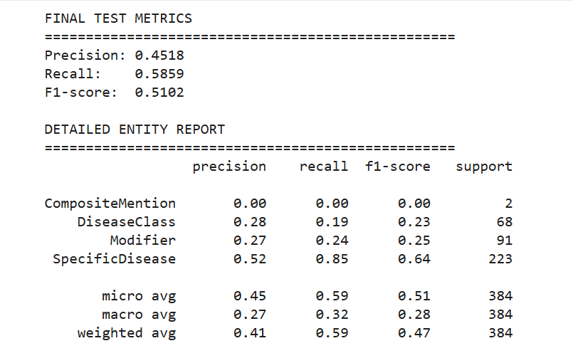
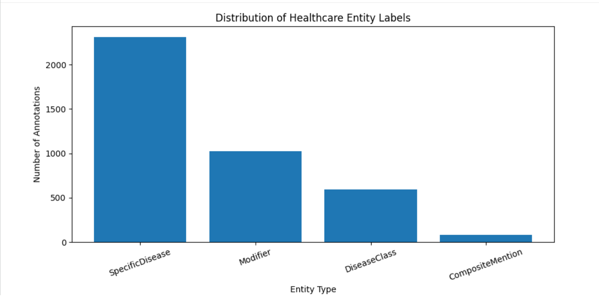
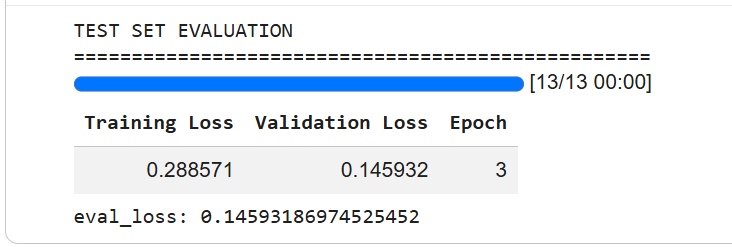
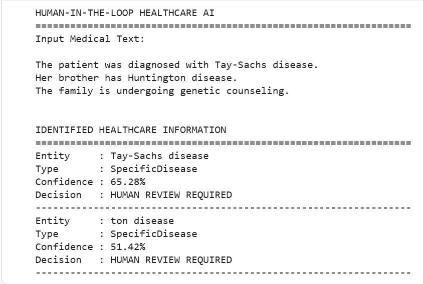

# Human-in-the-Loop Healthcare Information Identification Using BioBERT

A biomedical Named Entity Recognition (NER) project that uses BioBERT to identify disease-related healthcare information from biomedical text.

## Project Overview

This project fine-tunes BioBERT for healthcare information identification using an annotated biomedical text dataset based on the NCBI Disease Research Abstracts dataset.

The model identifies four healthcare entity categories:

- SpecificDisease
- DiseaseClass
- Modifier
- CompositeMention

The project also introduces a Human-in-the-Loop layer. Predictions below a selected confidence threshold are flagged for human review rather than being automatically accepted.

## Model Performance

Final held-out test results:

| Metric | Result |
|---|---:|
| Precision | 45.18% |
| Recall | 58.59% |
| F1-Score | 51.02% |

The strongest entity category was **SpecificDisease**, with approximately **85% recall** and an **F1-score of 0.64**.

### Final Model Evaluation

The final model was evaluated on the held-out test set using entity-level precision, recall, and F1-score.

### Healthcare Entity Distribution

Exploratory data analysis revealed a substantial class imbalance across the four healthcare entity categories.

### Training and Validation

BioBERT was fine-tuned for three epochs. The final training and validation results are shown below.

### Human-in-the-Loop Demonstration

A confidence-based review mechanism was added to flag uncertain healthcare entity predictions for human review.

## Technology Stack

- Python
- Google Colab
- BioBERT
- Hugging Face Transformers
- PyTorch
- scikit-learn
- Seqeval
- Matplotlib

## Key Features

- Biomedical Named Entity Recognition
- BioBERT transfer learning
- BIO token labeling
- WordPiece tokenization
- Long-document chunking
- Precision, Recall and F1 evaluation
- Confidence-aware predictions
- Human-in-the-Loop review

## Dataset

The project uses a prepared subset based on the NCBI Disease Research Abstracts dataset for healthcare entity extraction.

Dataset:
https://storage.googleapis.com/cloud-samples-data/language/ucaip_ten_dataset.jsonl

## Human-in-the-Loop Approach

The model produces a confidence score for detected healthcare entities.

High-confidence predictions can be accepted, while lower-confidence predictions can be flagged for human review.

The confidence threshold used in the project demonstration is experimental and is not a clinically validated threshold.

## Project Workflow

The project was developed as an end-to-end biomedical Named Entity Recognition pipeline:

1. **Dataset Acquisition**  
   Loaded the prepared NCBI Disease Research Abstracts dataset containing annotated biomedical text.

2. **Exploratory Data Analysis**  
   Examined the healthcare entity categories and identified significant class imbalance in the dataset.

3. **Data Preparation**  
   Converted character-level entity annotations into BIO labels for token classification.

4. **Biomedical Tokenization**  
   Used the BioBERT tokenizer to convert biomedical text into model-compatible tokens.

5. **Long Document Processing**  
   Applied overlapping chunking to process abstracts exceeding BioBERT's 512-token input limit.

6. **BioBERT Fine-Tuning**  
   Fine-tuned `dmis-lab/biobert-base-cased-v1.1` for healthcare Named Entity Recognition using PyTorch and Hugging Face Transformers.

7. **Model Evaluation**  
   Evaluated the trained model using entity-level Precision, Recall, and F1-score.

8. **Confidence-Based Prediction**  
   Generated entity predictions together with model confidence scores.

9. **Human-in-the-Loop Review**  
   Added an experimental confidence threshold that flags uncertain predictions for human review instead of automatically accepting them.

## References

- NCBI Disease Research Abstracts dataset (prepared dataset used in this project):  
  https://storage.googleapis.com/cloud-samples-data/language/ucaip_ten_dataset.jsonl

- Course textbook chapter: *Building AI Model for Healthcare Information Identification* - referenced for the original problem context and dataset selection.

## Disclaimer

This project is an educational and research prototype. It is not intended for clinical diagnosis, treatment decisions, or other medical decision-making.
